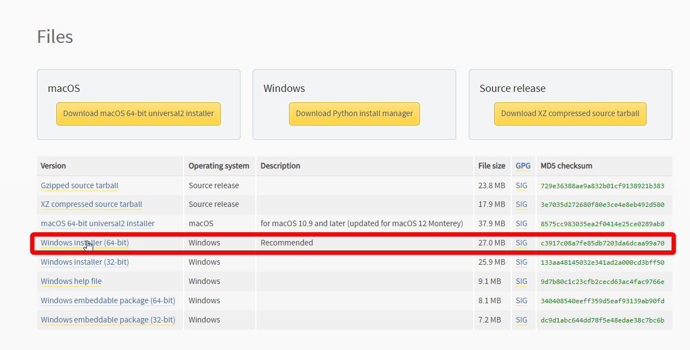
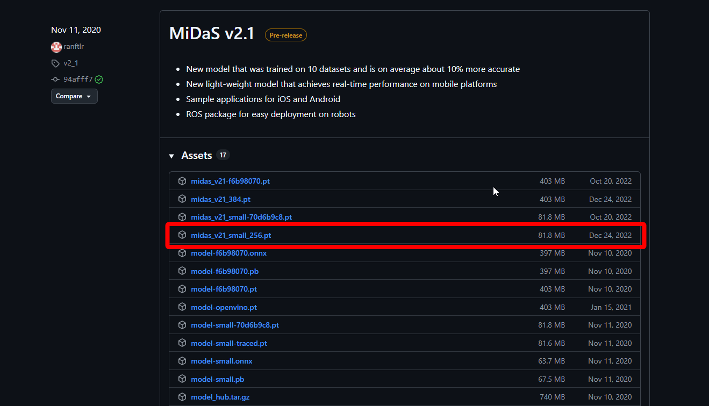

# ✨ OshiShine GOD Edition ✨

[🇯🇵 日本語 (Japanese)](#-日本語-japanese) | [🇬🇧 English](#-english)

---

## 🇯🇵 日本語 (Japanese)

**OshiShine GOD Edition** は、ゲーム画面やスクリーンキャプチャに対して、リアルタイムに「被写界深度（奥行き）」をAIで解析し、極上のカスタムライティング（照明効果）を後乗せできる最強のクリエイターツールです。元の高画質を一切劣化させず、ふんわりとしたソフトライトやシネマティックな影を作り出します。

### 🚀 主な機能
* **リアルタイムAI深度推定**: MiDaSモデルを使用し、画面内の「手前」と「奥」を自動で判別。
* **人物トラッキング**: YOLOv8により、キャラクターに自動で光が追従。
* **カスタムライト**: Sunlight, Point, Area, Rim（リムライト）の配置と、加算・スクリーン・覆い焼き・乗算などのブレンドモード対応。
* **高画質キープ＆4K保存**: 元のゲーム画面の解像度を維持したまま、ワンクリックで4Kアップスケール保存（Sキー）。

### 🛠️ 導入方法（インストール）

AIモデルの容量制限のため、以下の手順でセットアップしてください。

**1. 必要なソフトのインストール**
* [Python 3.10](https://www.python.org/downloads/release/python-3100/) をダウンロードしてインストールします。
* ⚠️ **【超重要】** インストール画面の最初にある **「Add Python.exe to PATH」** に必ずチェックを入れてください！

**2. アプリ本体のダウンロード**
* このGitHubページのリリースページより、バージョンを選択してダウンロードします。
* 好きな場所にZIPファイルを解凍してください。

**3. AIモデル（MiDaS）の配置**
* [MiDaS の dpt_beit_large_384.pt (約1.5GB) をダウンロード](https://github.com/isl-org/MiDaS/releases/download/v3_1/) します。
* 解凍したアプリのフォルダ内に **`model`** という名前の新しいフォルダを作成します。
* ダウンロードした `dpt_beit_large_384.pt` を、その `model` フォルダの中に入れます。

### 🎮 起動と使い方

1. フォルダ内にある **`Install_and_Start.bat`** をダブルクリックします。
   * 初回起動時のみ、自動的に仮想環境が作られ、必要なパーツ（YOLOモデル等）がダウンロードされます。少し待ってください。
   * 2回目起動時からは、**`OshiShine_v1_0_0.bat`** から起動してください。
2. アプリが起動したら、UIパネルからライトを追加して設定します。
3. **キーボード操作**:
   * `F9`: ライト配置モードのON/OFF（マウスのクリック位置にライトが移動します）
   * `S`: 現在のライティング状態で4Kスクリーンショットを高画質保存

---

🇬🇧 English
OshiShine GOD Edition is the ultimate creator's tool that uses real-time AI depth estimation to apply stunning, custom lighting effects to your game screen or screen captures. It perfectly preserves your original high-resolution footage while adding soft lights, dramatic shadows, and cinematic rim lighting.

🚀 Key Features
Real-time AI Depth Estimation: Uses the MiDaS model to automatically separate the foreground from the background.
Auto Person Tracking: Uses YOLOv8 to make lights automatically follow characters.
Custom Lights: Add Sunlight, Point, Area, and Rim lights. Supports blending modes like Add, Screen, Dodge, Multiply, and Darken.
Lossless Quality & 4K Export: Maintains original game resolution and allows one-click 4K upscaled screenshot saving (S key).
Vignette Effect: Darkens the edges of the screen to draw focus to the center.
🛠️ Installation Guide
Due to AI model file size limits on GitHub, please follow these setup instructions:

1. Install Prerequisites

Download and install Python 3.10.
⚠️ [CRITICAL] Make sure to check the box that says "Add Python.exe to PATH" at the very beginning of the installation!
2. Download the App

Click the green "Code" button on this GitHub page and select "Download ZIP".
Extract the ZIP file to your preferred location.
3. Place the AI Model (MiDaS)

Download the MiDaS model: dpt_beit_large_384.pt (~344MB).
Inside the extracted app folder, create a new folder named model.
Place the downloaded dpt_beit_large_384.pt file inside this model folder.
🎮 How to Run & Use
Double-click the Install_and_Start.bat file.
On the first run, it will automatically set up a virtual environment and download necessary components (like the YOLO tracking model). Please be patient.
Once the app launches, use the UI panel to add and tweak your lights.
Controls:
F9: Toggle Light Placement Mode (Click anywhere on the screen to move the selected light).
S: Save a high-quality 4K screenshot with your current lighting setup.